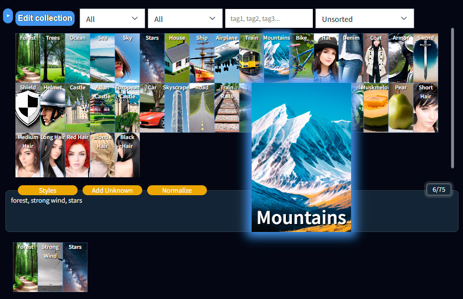
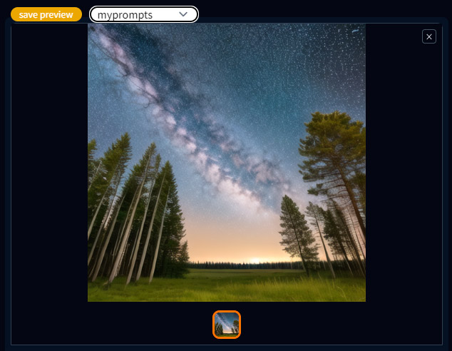
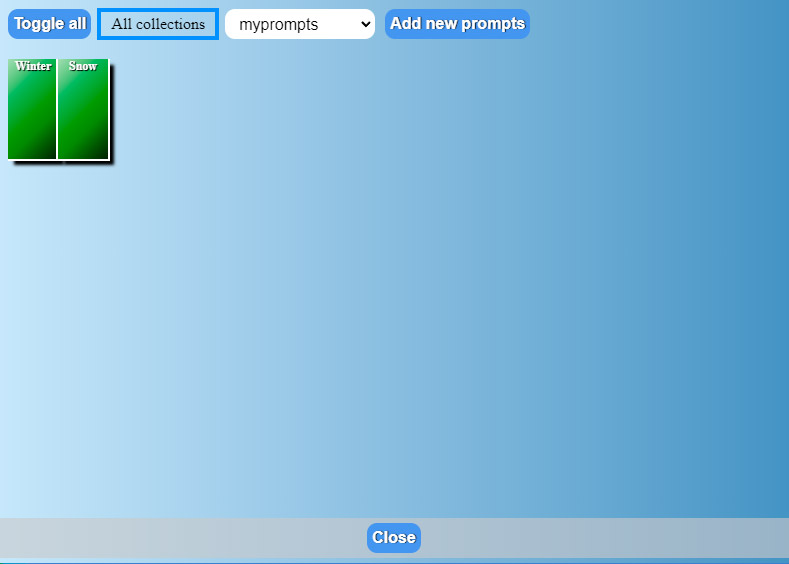
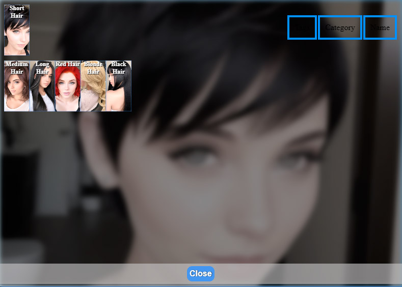
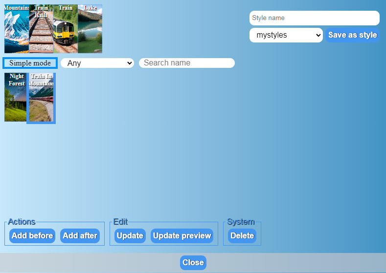
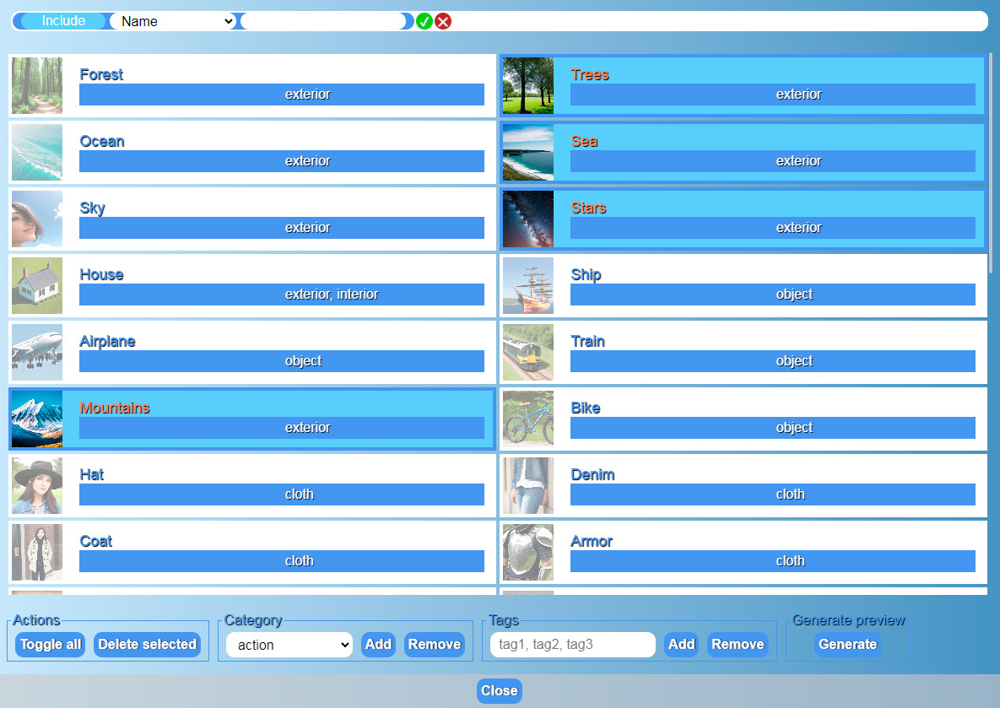
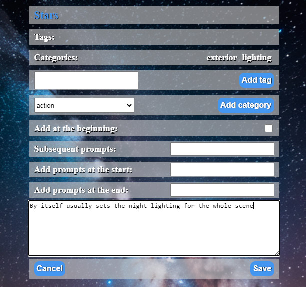

# Prompts Browser Extension 0.8
Prompts Browser Extension for the AUTOMATIC1111/stable-diffusion-webui client

## Installation:

1. Make sure you have the latest AUTOMATIC1111/stable-diffusion-webui version instaled. Prompt Browser 0.8 was tested and adapted for Webui version 1.2.1.

2. Install Node.js <https://nodejs.org/en/download>
The collections server runs on Node.js at the moment.

3. Unzip/clone the plugin into the `extensions/PromptsBrowser` folder.

4. In the stable-diffusion folder will be created folder `prompts_catalogue` with subfolder `myprompts` - this will be the first collection of prompts. As well as the folder `styles_catalogue` where new styles will be stored.

## Usage:

### Known Prompts Browser

1. The known prompts browser will display all known prompts from all the collections added to the `prompts_catalogue` folder.

2. `Click` on a prompt to add it to the active prompts.

3. `Shift + click`: opens prompt edition window.

4. `Ctrl/Meta + click`: opens the dialog of removing the sample from the collection (it will be lost).

5. Prompts in the collection can be moved by drag and drop.

### Active Prompts

1. Prompts can be added either manually via the text box or via the Prompt Browser.

2. The order of the Prompts can be changed by dragging them with the mouse.

3. `Shift + mouse wheel`: will change the weight of the Prompt depending on the direction of the mouse wheel.

4. `Ctrl + click`: deletes prompt from the active prompts.

5. `Double click`: opens the Prompt Tools.

### Adding new prompts to the collection

1. Enter text in the text box - the text will be divided by the presence of a comma in the prompts in the text box. If you click on the icon of a prompt, it will become the selected one. Now you can generate an image and if any of the currently active prompts is selected there will be a button `Save preview` above the generated image. By saving the preview, it will be added to the collection, and the preview image for that sample will be added to the collection's `preview` folder.

2. The `Add unknown` button above the Prompts entry field opens a window for adding new prompts. In this window you can select new prompts and a collection of prompts, where you can add them with the `Add new prompts` button. The `Toggle all` button selects or deselects all new proppts. The `All collections` toggle switches on or off the check for all possible collections (by default, it is on and only those prompts that are not in any of the possible collections will be displayed).

### Generating previews for prompts

1. You can select a prompt, generate an image and click the `Save preview` button above the generated image to create or replace the preview for that prompt.

2. You can use the `Collection editor` to generate previews for multiple prompts at once. You can open the Collection editor by clicking the `Edit collection` button above the list of known prompts. In the Collection editor window, you can click on the preview square of the prompt to mark it. You can also click on the `Toggle all` button to select all the prompts in the collection. You can also filter the prompts so that only prompts without previews are displayed. To do this, set the filter "exclude - meta - have preview". After that, you can click "Generate" and previews will be generated for all selected prompts one by one.

### Prompt tools

1. If you `double-click` on the active prompt, the Prompt Tools window will open.

2. A list of active prompts will be displayed at the top, where you can change the selected prompt.

3. Based on categories, tags and name of the prompt, similar prompts will be displayed.

4. Clicking on a promt from the list of similar promts will replace the selected promt with the target one.

5. `Shift + click` on a promt from the list will add the target promt to the active promts (keeping the selected promt).

### Styles

1. Above the text box there is now a `styles` button which opens the Styles window.

1. A list of active prompts will be displayed at the top.

1. The current prompts can be saved as a style by typing in the text box above the name of the style and clicking the `save` button next to it.

1. "Simple mode" switch changes styles view mode from the simple to the detailed mode.

1. In simple mode you need to select a prompt and then press a needed button at the bottom of the window.

1. Prompts from saved styles can be added to active prompts at the beginning of their list or at the end.

1. The `remove` button will delete the style from the database (it will be lost).

1. The `update` button will replace the style's prompts with the current active prompts.

1. The `Update preview` button will add/replace preview for the style using the currently generated and selected image.

1. In simple mode you can also click with `shift` key to add style. You can click and hold `ctrl/meta` key to delete style.

### Collection editor

1. You can open the `Collection editor` by clicking the `Edit collection` button above the list of known prompts.

1. You can click on the preview square of the prompt to mark it.

1. You can also select/deselect all prompts by clicking on `Toggle all`.

1. You can filter prompts by using filter menu at the top of the window.

1. You can delete selected prompt by pressing `Delete selected` button (this will remove them permanently).

1. If you have more than one collection installed, you will have the `Collection` block available. Selecting another collection and pressing `Move` or `Copy` will copy or move the selected props into the selected collection.

1. In the `Category` block you can select a category and add or remove it from all selected prompts.

1. In the `Tags` block you can write tags and add or remove them from all selected prompts.

1. By pressing `Generate` button you will start generating preview for all selected prompts.

### Prompt editor

1. By clicking on prompt in the `Known prompts list` holding `shift` key you will open target Prompt Editor window.

1. If you have same prompt in different collections you can switch between them with collection selector near prompt name.

1. If you have more than one collection installed, you can select another collection and `copy` or `move` target prompt there.

1. `Tags` and `Categories` lists shows prompt tags and collections. You can hold `ctrl/meta` and click on them to `remove` them.

1. You can enter new tags and click `Add tag` button to add them to the target prompt.

1. You can select new category and click `Add category` to add new category to the target prompt.

1. `Add at the beginning` - if checked will always add prompt to the start of other prompts. By default will add new prompt at the end of active prompts list.

1. `Subsequent prompts` - prompts to add right after target prompt.

1. `Add prompts at the start` - prompts to add at the start of the active prompts.

1. `Add prompts at the end` - prompts to add at the end of the active prompts.

1. You can add comment for the prompt in the comment text area.

1. Press `Save` to save your changes and close window or `cancel` to close window without saving.

