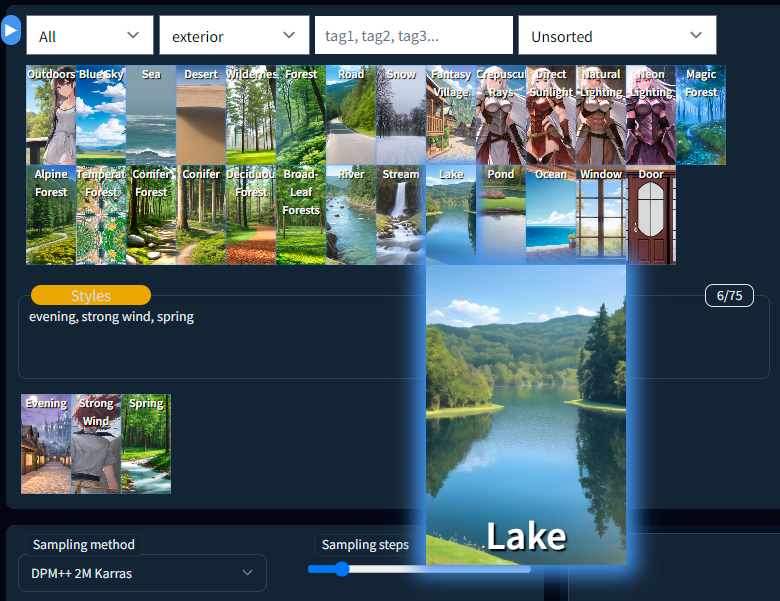

# Prompts Browser Extension 0.1
Prompts Browser Extension for the AUTOMATIC1111/stable-diffusion-webui client

## Installation:

1. Install node.js <https://nodejs.org/en/download>
The collections server runs on node. In the future I plan to rewrite the server in python and get rid of the dependency on node. but since I don't know python, this will take time.

2. Unzip/clone the plugin into the `extensions/PromptsBrowser` folder.

3. In the stable-diffusion folder will be created folder `prompts_catalogue` with subfolder `myprompts` - this will be the first collection of prompts. As well as the folder `styles_catalogue` where new styles will be stored.

## Usage:

### Adding new prompts to the collection

Enter text in the text box - the text will be divided by the presence of a comma in the prompts in the text box. If you click on the icon of a prompt, it will become the selected one. Now you can generate an image and if any of the currently active prompts is selected there will be a button `Save preview` above the generated image. By saving the preview, it will be added to the collection, and the preview image for that sample will be added to the collection's `preview` folder.

### Known Prompt Browser

1. The known prompts browser will display all known prompts from all the collections added to the `prompts_catalogue` folder.

2. click on a prompt to add it to the active prompts.

3. shift + click: opens prompt edition window.

4. ctrl (meta) + click: opens the dialog of removing the sample from the collection (it will be lost).

5. Prompts in the collection can be moved by drag and drop.

### Active Prompts

1. Prompts can be added either manually via the text box or via the Prompt Browser.

2. The order of the Prompts can be changed by dragging them with the mouse.

3. shift + mouse wheel: will change the weight of the Prompt depending on the direction of the mouse wheel.

4. ctrl + click: deletes prompt from the active prompts.

5. double click: opens the Prompt Tools.

### Prompt tools

1. If you double-click on the active prompt, the Prompt Tools window will open.

2. A list of active prompts will be displayed at the top, where you can change the selected prompt.

3. Based on categories, tags and name of the prompt, similar prompts will be displayed.

4. Clicking on a promt from the list of similar promts will replace the selected promt with the target one.

5. shift + click on a promt from the list will add the target promt to the active promts (keeping the selected promt).

### Styles

1. Above the text box there is now a `styles` button which opens the Styles window.

2. A list of active prompts will be displayed at the top.

3. the current prompts can be saved as a style by typing in the text box above the name of the style and clicking the `save` button next to it.

4. Prompts from saved styles can be added to active prompts at the beginning of their list or at the end.

5. The `remove` button will delete the style from the database (it will be lost).

6. The `update` button will replace the style's prompts with the current active prompts.
