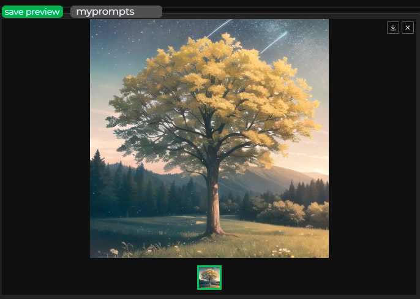

# Prompts Browser Extension 1.3.0
Prompts Browser Extension for the [AUTOMATIC1111/stable-diffusion-webui](https://github.com/AUTOMATIC1111/stable-diffusion-webui).

## Table of Contents

1. [Installation](#installation)
1. [Known Prompts Browser](#known-prompts-browser)
1. [Active Prompts](#active-prompts)
1. [Active prompts groups](#active-prompts-groups)
1. [Adding new prompts to the collection](#adding-new-prompts-to-the-collection)
1. [Generating previews for prompts](#generating-previews-for-prompts)
1. [Prompt tools](#prompt-tools)
1. [Styles](#styles)
1. [Collection editor](#collection-editor)
1. [Prompt editor](#prompt-editor)
1. [New Collection window](#new-collection-window)
1. [Autocomplete](#autocomplete)
1. [Normalize](#normalize)
1. [Setup window](#setup-window)
1. [Collections database](#collections-database)
1. [Development](#development)
1. [Credits](#credits)

### Changes in 1.3.0
⚠️ The client side was rewritten from javascript to typescript. In addition, the code has been refactored and redesigned to support prompt groups. This leaves a wide margin for possible bugs, so be prepared. ⚠️

- Group Support. Previously, the extension did not understand the prompt grouping syntax correctly, trying to transfer the detected weight of groups to each prompt individually. This did not allow to use the convenience of grouping prompts and caused various bugs. Now groups are understood as such and the interface of active prompts displays them as they are. In addition, the functionality of working with groups using the active prompts interface has been added.

- Previously, the application tried to prevent the addition of identical prompts. However, there are many scenarios in which using the same prompts more than once is desirable. These restrictions have been removed and it is now possible to add the same prompt more than once.

## Installation:

1. Make sure you have the latest AUTOMATIC1111/stable-diffusion-webui version instaled. Prompt Browser 1.2.0 was tested and adapted for WebUI versions 1.8.0.

2. Unzip/clone the plugin into the extensions directory. Or install it using WebUI Extensions -> Install from URL tab.

3. On first run in the Prompts Browser Extension directory will be created directory `prompts_catalogue` with subdirectory `myprompts` - this will be the first collection of prompts. As well as the directory `styles_catalogue` where new styles will be stored.

4. With the extension installed, you can add the startup argument to Stable Diffusion WebUI `--prompts-browser-readonly`. With this argument, the extension client and server will be read-only, which may be desirable when using the extension when hosting the application online. 

### Important

This extension modifies the DOM directly, without working through any API for such purposes. As such, an update to AUTOMATIC1111/stable-diffusion-webui could potentially break some functionality of this extension until the extension is in turn updated to work with a newer version of WebUI. If something stops working after WebUI update - create a ticket.

## Usage:

### Known Prompts Browser

1. The known prompts browser will display all known prompts from all the collections added to the `prompts_catalogue` directory.

2. `Click` on a prompt to add it to the active prompts.

3. `Shift + click`: opens prompt edition window.

4. `Ctrl/Meta + click`: opens the dialog of removing the prompt from the collection (it will be lost).

5. Prompts in the collection can be moved by drag and drop.

6. You can filter prompts using filter params like collection, category, tags (supports autocomplete of known tags) and name.

7. You can change sorting mode in the order drop down menu.

### Active Prompts

1. Prompts can be added either manually via the text box or via the Prompt Browser.

2. The order of the Prompts can be changed by dragging them with the mouse.

3. `Shift + mouse wheel`: will change the weight of the Prompt depending on the direction of the mouse wheel.

4. `Ctrl/Meta + click`: deletes prompt from the active prompts.

5. `Double click`: opens the Prompt Tools.

6. `shift` + click: opens Prompt Editor.

### Active prompts groups

1. You can group prompts together by dragging one on top of the other while holding down the `shift` key.

1. Groups will also be displayed if you manually type them into a text field or paste text from the clipboard.

1. You can perform operations with groups using the group header element in the same way as you do with regular prompts.

1. Groups can be moved in the same way as regular prompts.

1. Groups can be nested within other groups.

1. Clicking on the group header allows you to fold and unfold the group.

1. `Shift + mouse wheel`: will change the weight of the Group depending on the direction of the mouse wheel.

1. `Ctrl/Meta + click`: Ungroups the prompts back.

### Adding new prompts to the collection

1. Enter text in the text box - the text will be divided by the presence of a comma in the prompts in the text box. If you click on the icon of a prompt, it will become the selected one. Now you can generate an image and if any of the currently active prompts is selected there will be a button `Save preview` above the generated image. By saving the preview, it will be added to the collection, and the preview image for that sample will be added to the collection's `preview` directory.

2. The `Add unknown` button above the Prompts entry field opens a window for adding new prompts. In this window you can select new prompts and a collection of prompts, where you can add them with the `Add new prompts` button. The `Toggle all` button selects or deselects all new proppts. The `All collections` toggle switches on or off the check for all possible collections (by default, it is on and only those prompts that are not in any of the possible collections will be displayed).

3. You can add a new prompt to the desired collection by copying it or moving it from another collection. A collection is a directory that can be moved between installations, thus presenting the possibility of sharing prompts and styles.

### Generating previews for prompts

1. You can select a prompt, generate an image and click the `Save preview` button above the generated image to create or replace the preview for that prompt.

2. You can use the `Collection editor` to generate previews for multiple prompts at once. You can open the Collection editor by clicking the `Edit collection` button above the list of known prompts. In the Collection editor window, you can click on the preview square of the prompt to mark it. You can also click on the `Toggle all` button to select all the prompts in the collection. You can also filter the prompts so that only prompts without previews are displayed. To do this, set the filter "exclude - meta - have preview". After that, you can click "Generate" and previews will be generated for all selected prompts one by one.

3. You can select additional styles to be used during autogeneration.

	1. `Prompt only` - only prompt itself will be used for generating preview.
	1. `With current prompt` - target prompt will be added to the current prompts in the positive prompts textbox.
	1. `With prompt autogen style` - If a prompt has a style assigned for autogeneration, it will use that prompt and the assigned style. If the prompt does not have an autogenerate-style, only the prompt itself will be used.
	1. `With selected autogen style` - the currently selected style in the `Autogenerate style` field will be used as the style for autogeneration.

### Prompt tools

1. If you `double-click` on the active prompt, the Prompt Tools window will open.

2. A list of active prompts will be displayed at the top, where you can change the selected prompt.

3. Based on categories, tags and name of the prompt, similar prompts will be displayed.

4. Prompts will be sorted by their similarity to the selected prompt according to the selected parameters (tags, categories and name).

5. If `Replace mode` is active, than clicking on a prompt from the list of similar prompts will replace the selected prompt with the target one. If it is not active - will add the target prompt to the active promts (keeping the selected prompt).

6. `Shift + click`: opens prompt edition window.

### Styles

1. Above the text box there is a `Save style` button which opens the Save Style window.

1. A list of active prompts will be displayed at the top.

1. The current prompts can be saved as a style by typing in the text box above the name of the style and clicking the `Save as style` button next to it.

1. In the list of style collections, you can select the collection where the style will be saved. You can also select the current generation parameters that will be saved along with the style's prompts (such as negative prompts, size, sampler, etc).

1. Above the text box there is a `styles` button which opens the Styles window.

1. "Simple mode" switch changes styles view mode from the simple to the detailed mode.

1. In simple mode you need to select a prompt and then press a needed button at the bottom of the window.

1. Prompts from saved styles can be added to active prompts at the beginning of their list or at the end.

1. The `remove` button will delete the style from the database (it will be lost).

1. The `update` button will replace the style's prompts with the current active prompts.

1. Like with saving of a style you can choose what meta information must be stored in the updated style.

1. The `Update preview` button will add/replace preview for the style using the currently generated and selected image.

1. In simple mode you can also click with `shift` key to add style. You can click and hold `ctrl/meta` key to delete style.

1. To rename a style, select it and enter the desired new name in the bottom panel of the window, then click `Rename`. The name of the style must be unique in the collection.

### Collection editor

1. You can open the `Collection editor` by clicking the `Edit collection` button above the list of known prompts.

1. The collection selected in the collections filter field of known prompts will be opened for editing. If no collection is selected, the first collection from the list of collections will be opened.

1. You can click on the preview square of the prompt to mark it.

1. You can also select/deselect all prompts by clicking on `Toggle all`.

1. You can filter prompts by using filter menu at the top of the window.

1. You can delete selected prompt by pressing `Delete selected` button (this will remove them permanently).

1. If you have more than one collection installed, you will have the `Collection` block available. Selecting another collection and pressing `Move` or `Copy` will copy or move the selected props into the selected collection.

1. In the `Category` block you can select a category and add or remove it from all selected prompts.

1. In the `Tags` block you can write tags and add or remove them from all selected prompts.

1. In the `Autogenerate style` you can assign style to be used with preview image autogeneration for this prompt.

1. By pressing `Generate` button you will start generating preview for all selected prompts. See autogeneration subsection of [Generating previews for prompts](#generating-previews-for-prompts).

### Prompt editor

1. By clicking on prompt in the `Known prompts list` holding `shift` key you will open target Prompt Editor window.

1. If you have same prompt in different collections you can switch between them with collection selector near prompt name.

1. If you have more than one collection installed, you can select another collection and `copy` or `move` target prompt there.

1. `Tags` and `Categories` lists shows prompt tags and collections. You can hold `ctrl/meta` and click on them to `remove` them.

1. You can enter new tags and click `Add tag` button to add them to the target prompt.

1. You can select new category and click `Add category` to add new category to the target prompt.

1. `Autogen` - assigns style to be used with prompt preview autogeneration. See autogeneration subsection of [Generating previews for prompts](#generating-previews-for-prompts).

1. `Add at the beginning` - if checked will always add prompt to the start of other prompts. By default will add new prompt at the end of active prompts list.

1. `Subsequent prompts` - prompts to add right after target prompt.

1. `Add prompts at the start` - prompts to add at the start of the active prompts.

1. `Add prompts at the end` - prompts to add at the end of the active prompts.

1. `Add at the beginning`, `Subsequent prompts`, `Add prompts at the start` and `Add prompts at the end` are useful when working with LORAs. For example, if a LORA requires specific prompts for activation, you can assign them to be automatically appended along with the LORA. You can also assign LORA prompt for some prompts if you always want to use them together. 

1. You can add comment for the prompt in the comment text area.

1. Press `Save` to save your changes and close window or `cancel` to close window without saving.

### New Collection window

1. Click on `New Collection` button at the top menu to open New Collection window.

1. Previously, the extension settings window was also located here. But now all extension settings are located in the `Prompts Browser` category of WebUI settings.

1. `New prompts collections` - will open creation of the new prompts collection.

1. `New styles collections` - will open creation of the new styles collection.

1. `Collection name` - name of the collection. A directory with the same name will be created.

1. `Store format` - the way prompts/styles are stored. In the `short` format all prompts/styles data will be saved in the file `data.json`. In the `expanded` format a directory `prompts`/`styles` will be added to the collection directory and every prompt/style will be stored as a separate file. The expanded format makes it easier to work with the collection when using version control systems like Git.

### Autocomplete

1. When you manually type prompts, a menu with similar prompts from the database of known prompts will be displayed. You can finish a prompt from the autocomplete menu by clicking on it or by selecting it with the up and down arrows and pressing Enter.

1. You can also enter style names to quickly add them. Since styles do not necessarily have to consist of positive prompts, you can use this to quickly switch between a set of negative prompts, change the resolution or generation quality settings.

1. Autocomplete can be turned off in the settings. It can also be enabled only for prompts or only for styles.

### Normalize

1. The `normalize` button is displayed above the positive prompt field. It activates the function of normalization of the entered prompts according to the settings of normalization of prompts set in the [Setup window](#setup-window). Useful when inserting prompts from external sources.

1. If the prompt in its current form is already known and stored in the collection in the same form, it will not be changed even if it does not satisfy the normalization settings.

### Setup window

1. You can customize the extension by going to the `Settings` section of the WebUI. The extension settings are located in the `Prompts Browser` section.

1. `Autocomplete mode` - defines the behavior of the autocomplete function.

1. `Show prompt index in database` - will display the ordinal id of the prompt in the collection if the collection is selected in the collection filter. Useful when manually sorting prompts within a collection.

1. `Extended syntax support` - enables support for displaying some extended syntax elements for prompts that can be used by some other extensions. 

1. `Below 1 scroll weight` - how much weight one mouse wheel movement will change when below weight 1.

1. `Above 1 scroll weight` - how much weight one mouse wheel movement will change when above weight 1.

1. `Transform prompts to lower case` - will change prompts in the prompts textarea to be lower case.

1. `Spaces in prompts transform` - changes the handling of spaces in multiword prompts. Can be `Do nothing`, `To space` and `To underscore`.

1. `Card width` - small card preview width.

1. `Card height` - small card preview height.

1. `Splash card width` - large card preview width.

1. `Splash card height` - large card preview height.

1. `Rows in cards list` - number of displayed rows in the list of known prompts. The size of the known prompts area will be adjusted to display no more than this number of rows. The height of the known prompts area will be calculated based on this parameter and the height of the small card.

1. `Max shown cards in a list` - when displaying a list of prompts, this will be the maximum ceiling above which prompts will no longer be displayed. It may be useful when working with very large collections, so as not to overload the page with a large number of elements.

1. `Resize thumbnails` - if this option is enabled, when you save the preview, it will be resized to the desired size and format. The size of the resized image will not exceed the specified maximum height or width ceiling with preserved aspect ratio.

1. `Resize thumbnails: max width` - maximum width of the resized image.

1. `Resize thumbnails: max height` - maximum height of the resized image.

1. `Resize thumbnails: file format` - resized image format.

### Collections database

This extension does not come with a pre-built prompts database. It is up to the user to choose a ready-made database or create their own. Remember that collections goes into the **prompts_catalogue** directory inside your Stable Diffusion Web UI directory. This directory is being crated after at least one start of SDWebUI with the installed Prompts Browser Extension.

Some existing collections:

1. [prompts_portrait](https://github.com/AlpacaInTheNight/prompts_portrait) - A proof of concept collection for generating character portraits. Comes with tags and categories tagged in.

### Development

1. Project structure
    * `client` - extension typescript source code.
    * `javascript` - compiled javascript and javascript libraries.
    * `server` - python fastAPI server methods.
    * `scripts` - python extension code.

1. Extension styles are located in the style.css file, as well as in the exported style files in the client folder for the corresponding extension component.

1. Typescript code requires a compiler that requires Node.js.
    * Install [Node.js](https://nodejs.org/en/download/).
    * Run `npm install` to install the required dependencies.
    * Run command `npm run start` to start typescript compiler.
    * Webpack will track changes to the typescript source and compile the javascript bundle for the browser.

1. `promptBrowser.js` in the `javascript` is a compiled file and should not be changed manually.

1. It is not necessary to add the `promptBrowser.js` file to commits.

### Credits

- Textarea Caret Position - https://github.com/component/textarea-caret-position Library to get a caret position in the textarea element. MIT License.
 
